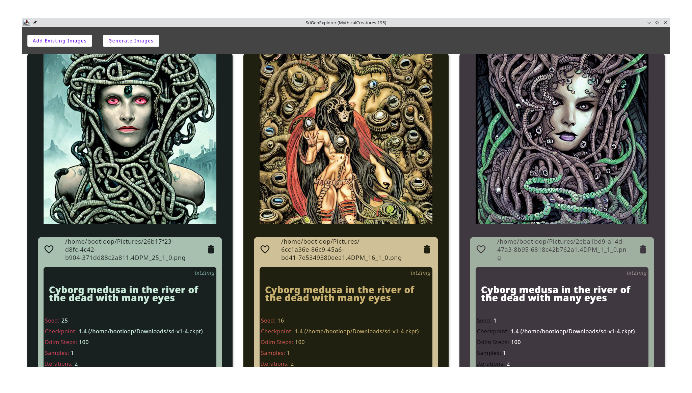
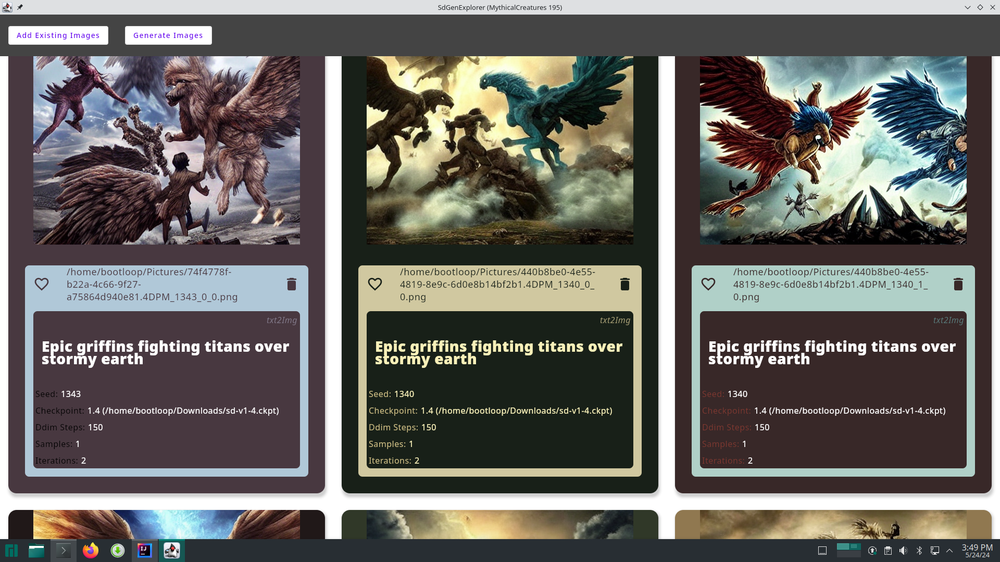
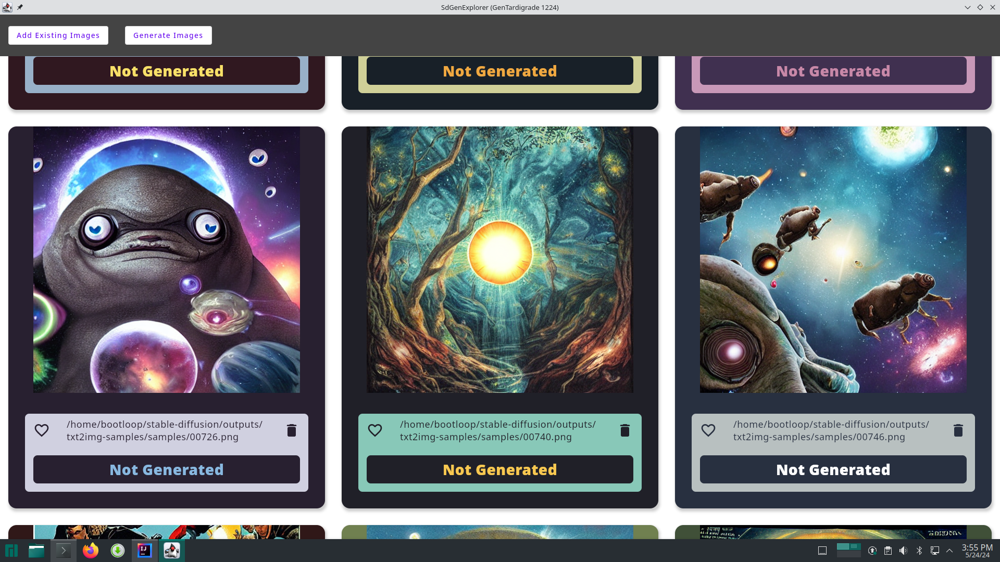
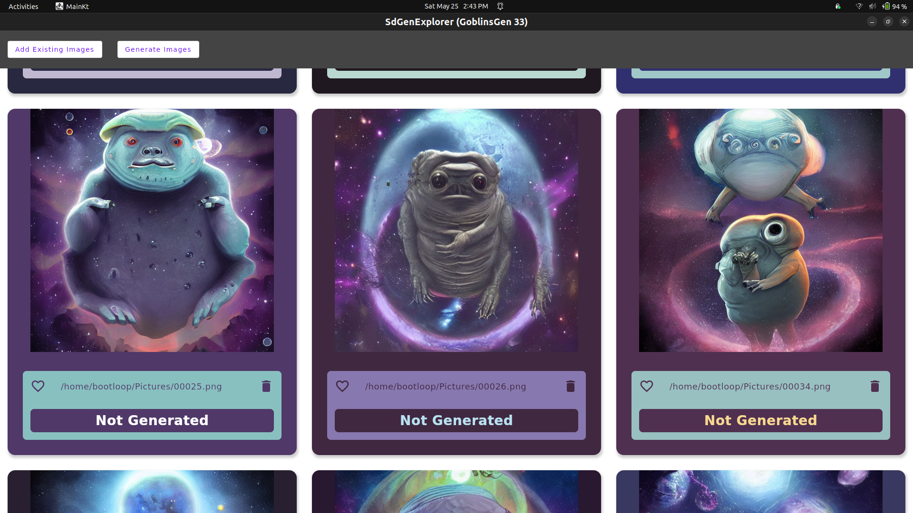
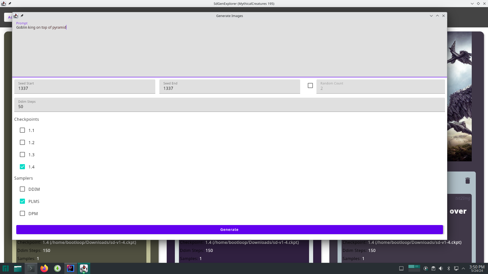

# SdGenExplorer
Desktop application to view, manage, and create Stable Diffusion generated content. Built with Kotlin + Compose. 

Note: this does not include the stable diffusion code to generate but instead will call to any generation script (txt2Img and img2Img)

## About
Locally running stable diffusion models is easy enough thanks to projects like https://github.com/CompVis/stable-diffusion but while I was exploring and generating images, it was way too common to forget the exact parameters I used to generate the images. Things like what prompt did I use, what seeds did I try, what type of sampler or checkpoint did I generate these images with are questions that I attempted to solve with this desktop application.

## Features
* create and save projects
* generate images from text
* generate images from images
* keeps track of generation metadata
* keeps track of generation requests and queues them so you can quickly make multiple different requests

## Screenshots

## How do I build and run this?

TODO(fill out section, pull out the few hardcoded strings): download a stable diffusion model, create new project in this application and point a few scripts to the downloaded locations (some are still hardcoded, which will change, but looking at scripts/ and for "bootloop" in the project creation code can make this run against local models)

https://github.com/JsFlo/SdGenExplorer/assets/3820069/05cb3c20-b523-4673-a045-48e809f4a2d2

https://github.com/JsFlo/SdGenExplorer/assets/3820069/97b83355-b5f6-4250-9fbd-4ff777dcb91d

https://github.com/JsFlo/SdGenExplorer/assets/3820069/48478703-97a7-42b8-9de1-b88e71bea217

